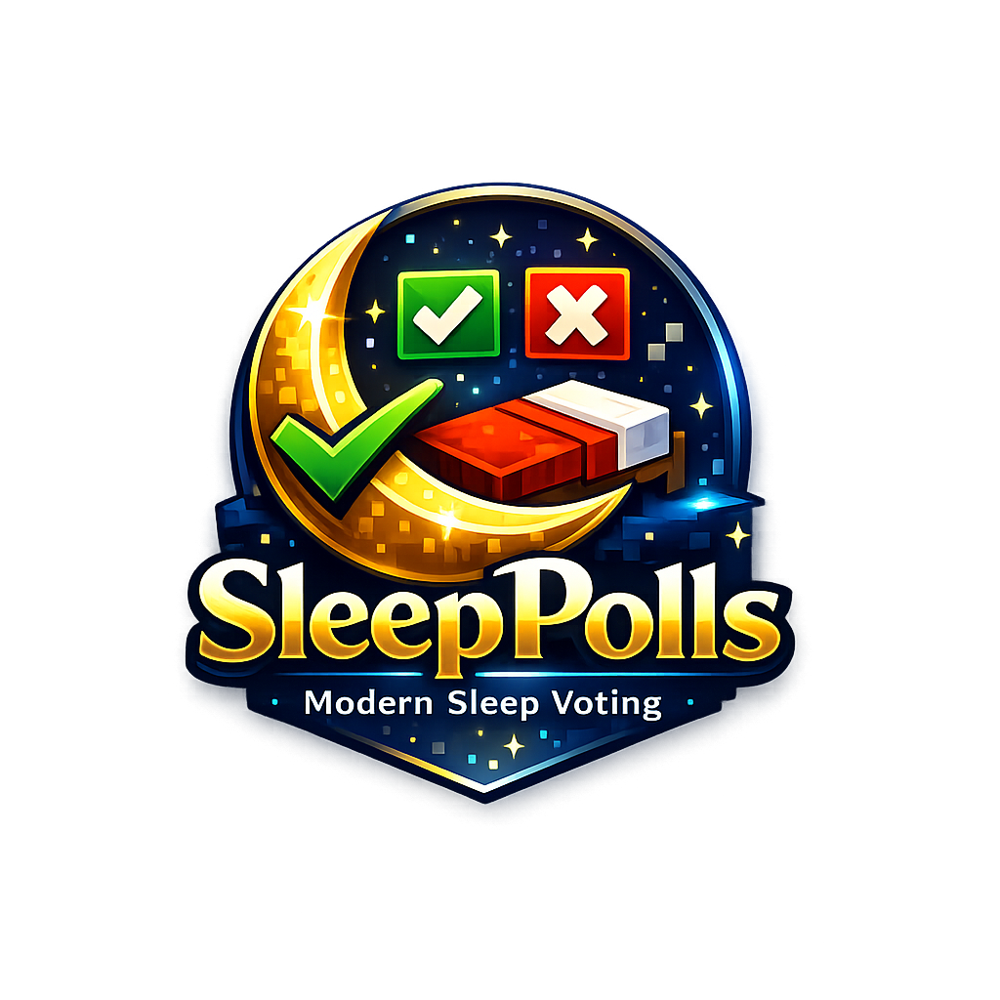

# SleepPolls

> A modern sleep voting system for Paper servers that transforms night-time gameplay with democratic polling.

---

<p align="center">
  
</p>

<h1 align="center">SleepPolls</h1>

<p align="center">
  Modern sleep voting for Paper servers.
</p>

<p align="center">
  
  
  
</p>

---

## 🎯 Overview

**SleepPolls** is a sophisticated Minecraft plugin that revolutionizes how servers handle sleep mechanics. Instead of a single player automatically skipping the night for everyone, SleepPolls initiates a real-time democratic vote. Players receive beautiful interactive vote buttons, live countdown displays, and instant feedback—all while maintaining server performance and customization options.

Perfect for survival servers, SMPs, and communities that value collaborative decision-making.

---

## ✨ Features

- **🌙 Sleep Voting System** — When a player enters a bed during night, an instant poll launches to determine if the night should be skipped
- **🖱️ Clickable Vote Buttons** — Interactive YES/NO buttons with hover previews using Adventure API components
- **📊 BossBar Display** — Real-time countdown timer with vote progress tracking (toggleable per player)
- **💬 ActionBar Updates** — Live vote count and remaining time displayed above the hotbar
- **🔊 Audio Feedback** — Customizable sound effects for poll start and countdown completion
- **⏰ Configurable Duration** — Adjust poll length from 15 to 60+ seconds based on server size
- **📈 Flexible Vote Requirements** — Set the percentage needed (50-100%) for night skip approval
- **😴 AFK Detection** — Seamless EssentialsX integration to exclude AFK players from polls
- **🌍 World Blacklist** — Disable polls in specific worlds (lobbies, minigames, creative)
- **⚡ Minimum Player Validation** — Polls require at least 2 active players to initiate
- **🌧️ Weather Control** — Optional auto-clearing of rain and thunder on successful skip
- **⚙️ Production-Ready Configuration** — Extensive YAML config with sensible defaults
- **✅ Permission System** — Fine-grained control over who can reload config or toggle bossbars

---

## 📦 Installation

### Prerequisites
- **Server Software**: Paper 26.1.2 or later (required for Bootstrap system)
- **Java Version**: Java 25 or later
- **Minecraft Version**: 1.21+
- **Optional Dependency**: [EssentialsX](https://essentialsx.net/) (for AFK detection)

### Installation Steps

1. **Download the plugin**
   - Download the latest `SleepPolls-*.jar` from [Releases](#)

2. **Place the plugin**
   ```bash
   # Move the JAR to your server's plugins folder
   mv SleepPolls-1.0.0.jar /path/to/server/plugins/
   ```

3. **Start or restart your server**
   ```bash
   # The plugin will load automatically
   # Config file will be generated at: plugins/SleepPolls/config.yml
   ```

4. **Verify installation**
   ```minecraft
   /sp version
   # Output: Running SleepPolls 1.0.0
   ```

5. **Configure (optional)**
   - Edit `plugins/SleepPolls/config.yml` to customize behavior
   - Reload with `/sp reload` without restarting

---

## 🎮 Commands

| Command | Aliases | Description | Permission |
|---------|---------|-------------|-----------|
| `/sleeppoll help` | `/sp help` | Display the help menu | None |
| `/sleeppoll version` | `/sp version` | Show plugin version | None |
| `/sleeppoll status` | `/sp status` | View current poll information (world-specific) | None |
| `/sleeppoll yes` | `/sp yes` | Vote YES to skip the night | None |
| `/sleeppoll no` | `/sp no` | Vote NO to keep the night | None |
| `/sleeppoll bossbar` | `/sp bossbar` | Toggle personal BossBar notifications | `sleeppolls.bossbar` |
| `/sleeppoll reload` | `/sp reload` | Reload configuration from disk | `sleeppolls.reload` |

---

## 🔐 Permissions

| Permission | Default | Description |
|-----------|---------|-------------|
| `sleeppolls.reload` | Op only | Allows use of `/sp reload` command |
| `sleeppolls.bossbar` | Everyone | Allows toggling BossBar notifications per-player |

> **Note**: Voting commands (`yes`, `no`, `status`, `version`, `help`) are available to all players without special permissions.

---

## ⚙️ Configuration

The plugin uses a single YAML configuration file located at `plugins/SleepPolls/config.yml`. Edit this file and run `/sp reload` to apply changes without restarting.

### Poll Settings

```yaml
# Duration of a sleep poll in seconds.
#
# Recommended values:
#   15  = Fast-paced servers, quick decision-making
#   20  = Balanced (default, recommended)
#   30+ = Large SMPs, slower decision-making
poll-duration-seconds: 20

# Percentage of YES votes required to skip the night.
#
# Examples:
#   50  = Simple majority (half + 1)
#   60  = Moderate consensus
#   75  = Strong consensus required
required-percentage: 50
```

### BossBar Settings

```yaml
bossbar:
  # Enables the BossBar countdown display.
  # Shows remaining time, required votes, and current YES votes.
  # Players can disable this individually with /sp bossbar
  enabled: true
```

### Sound Settings

```yaml
sounds:
  # Enables all plugin sounds.
  # Includes poll start alert and countdown completion.
  # Players with sound disabled in-game won't hear these.
  enabled: true
```

### Weather Settings

```yaml
weather:
  # Automatically clear rain after a successful poll
  clear-rain: true

  # Automatically clear thunder after a successful poll
  clear-thunder: true
```

### World Settings

```yaml
worlds:
  # List of worlds where sleep polls are COMPLETELY DISABLED.
  # Entering a bed in these worlds will not trigger a poll.
  #
  # Common examples:
  #   - lobby      (prevents poll spam in hub areas)
  #   - spawn      (keeps spawn peaceful)
  #   - minigames  (prevents polls during activities)
  blacklist:
    - lobby
    - minigames
```

### Example Configurations

**Fast-Paced PvP Server** (emphasizes quick decisions)
```yaml
poll-duration-seconds: 15
required-percentage: 50  # Simple majority
bossbar:
  enabled: true
sounds:
  enabled: true
```

**Large Community SMP** (emphasizes consensus)
```yaml
poll-duration-seconds: 30
required-percentage: 65  # Stronger consensus
bossbar:
  enabled: true
sounds:
  enabled: true
```

---

## 🔄 How It Works

### The Polling Flow

1. **Initiation**: A player attempts to enter a bed during night time (13000–23000 game ticks)
2. **Eligibility Check**: Server calculates active voters:
   - Online players in the same world
   - Non-AFK players (EssentialsX integration)
   - Non-spectator mode
   - Alive players
   - **Minimum 2 players required**
3. **Vote Notification**: All eligible voters receive:
   - Chat message with clickable [✔ YES] and [✖ NO] buttons
   - BossBar countdown timer (if enabled)
   - Sound alert (if enabled)
4. **Voting Window**: Players vote using `/sp yes` or `/sp no` (or click buttons)
5. **Real-Time Display**: ActionBar shows live vote count and remaining seconds
6. **Result Resolution**:
   - **SUCCESS**: YES votes reach required percentage → Night skipped, weather cleared, success message
   - **FAILURE**: Time expires or NO votes prevent majority → Night continues, failure message
   - **DUPLICATE**: Poll already active in world → User receives "poll in progress" message

### Vote Calculation

The plugin calculates required votes dynamically:

```
votes_needed = ceil(total_eligible_players × (required_percentage ÷ 100))
```

**Example with 8 players and 50% requirement:**
- `votes_needed = ceil(8 × 0.50) = 4`
- At least 4 YES votes needed out of 8 eligible voters

### AFK Handling

If **EssentialsX** is installed, SleepPolls automatically:
- Detects AFK players using EssentialsX API
- Excludes AFK players from the eligible voter pool
- Does NOT count their vote slots toward requirements

If EssentialsX is not installed, all online players are considered active.

### Cooldown & Minimum Players

- **No hard cooldown** between polls, but each poll must finish naturally
- **Minimum 2 active players** required to start a poll
- **One poll per world** at a time (attempting to sleep during active poll cancels bed entry)

---

## 🛠️ Technical Details

### Architecture

- **Framework**: Built on the modern Paper Bootstrapper system for optimal performance
- **Command Framework**: [Lamp](https://github.com/Revxrsal/Lamp) 4.0.0-rc.12 for flexible, maintainable command routing
- **Text Components**: Adventure API for rich, interactive chat elements with click events
- **Integration**: Native Paper API + optional EssentialsX hooking
- **Packaging**: Shadow Jar with relocated Lamp library to prevent conflicts

### Build System

- **Build Tool**: Gradle with Kotlin DSL
- **Compilation**: Java 25 target with `-parameters` flag for preserved method names
- **Output**: SleepPolls-1.0.0.jar (all-in-one, plugin-ready)

### Dependencies

| Dependency | Version | Scope | Purpose |
|-----------|---------|-------|---------|
| Paper API | 26.1.2 | Compile | Server API and Bootstrap system |
| Lamp | 4.0.0-rc.12 | Shade | Command routing framework |
| EssentialsX | 2.21.1 | Optional | AFK player detection |
| Gson | 2.13.1 | Paper-provided | JSON configuration loading |

---

## 🗺️ Roadmap

- [ ] **Multi-World Vote Averaging** — Aggregate votes across linked worlds
- [ ] **Vote Streaks & Achievements** — Track player voting patterns and unlockable badges
- [ ] **Custom Vote Messages** — Configurable titles, formats, and colors in messages
- [ ] **Statistics Dashboard** — `/sp stats` command showing historical poll data
- [ ] **PlaceholderAPI Integration** — Placeholders for leaderboards and info displays
- [ ] **Alternative Vote Methods** — Inventory GUIs or sign interactions for voting
- [ ] **Economy Integration** — Optional voting costs/rewards for relevant plugins
- [ ] **Time Skip Customization** — Configure exactly how many ticks to skip on success

---

## 🤝 Contributing

Contributions are welcome! To contribute:

1. **Fork** the repository
2. **Create a feature branch** (`git checkout -b feature/your-feature`)
3. **Commit changes** with clear messages
4. **Push to your fork** (`git push origin feature/your-feature`)
5. **Open a Pull Request** with a description of changes

### Development Setup

```bash
# Clone the repository
git clone https://github.com/Amethyst-Developers/Sleep-Polls.git
cd Sleep-Polls

# Build the plugin
./gradlew build

# Run the test server
./gradlew runServer

# Output JAR location
# build/libs/SleepPolls-1.0.0.jar
```

### Code Style

- Follow standard Java naming conventions
- Use 4-space indentation
- Preserve Adventure API component builders for readability
- Add comments for complex game logic

---

## 📄 License

This project is licensed under the **GNU General Public License v3.0** (GPL-3.0-or-later).

### 🔓 What this means:

- ✅ **Free to use** - You can use this software for any purpose
- ✅ **Free to modify** - You can change the code to suit your needs  
- ✅ **Free to distribute** - You can share copies with others
- ✅ **Source code available** - Full source code is provided
- ⚠️ **Copyleft** - Any derivative works must also be GPL v3.0 licensed

### 📋 Requirements for users:

- **Attribution** - You must include the original copyright notice
- **License preservation** - You must include the GPL v3.0 license text
- **Source code** - If you distribute the software, you must provide source code
- **No additional restrictions** - You cannot add proprietary restrictions

### 🔗 Legal Resources:

- [GPL v3.0 License Text](https://www.gnu.org/licenses/gpl-3.0.html)
- [GPL v3.0 FAQ](https://www.gnu.org/licenses/gpl-faq.html)
- [Free Software Foundation](https://www.fsf.org/)

---

## 🙋 Support & Community

- **Issues**: Report bugs or suggest features on [GitHub Issues](#)
- **Documentation**: Full config guide included in `config.yml`
- **Questions**: Ask in plugin comments or community forums

---

## 👥 Credits

**SleepPolls** is developed and maintained by **Amethyst Developers**.

Built with:
- [Paper](https://papermc.io/) — Best-in-class Minecraft server software
- [Adventure](https://github.com/KyoriPowered/adventure) — Modern text components
- [Lamp](https://github.com/Revxrsal/Lamp) — Powerful command framework

---

<div align="center">

**[⬆ back to top](#sleeppolls)**

Made with ❤️ for the Minecraft community

</div>
